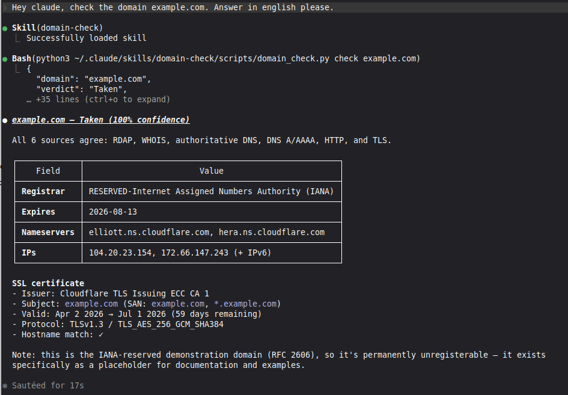
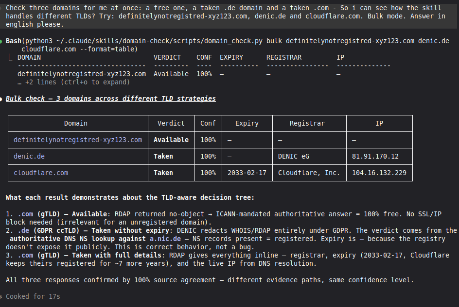

# domain-check

> Cross-platform, dependency-free domain availability checker — runs as a plugin in **Claude Code**, an extension in **Gemini CLI**, and a skill in **Codex CLI** / **OpenCode**, or as a plain Python CLI.

[](https://www.python.org/downloads/)
[](https://agentskills.io)
[](#requirements)
[](#platform-support)
[](LICENSE)

Ask your coding agent **"is `example.com` free?"** and get an evidence-backed answer with the registrar, expiration date, server IPs, and full SSL certificate inline — for any TLD on the planet, including GDPR-redacted ccTLDs like `.de`, `.eu`, `.at`, `.ch`, `.es`.

### Single check — full evidence inline



### Bulk check — three TLDs, three evidence paths



> The `.de` row legitimately has no expiry — DENIC redacts that field under GDPR. The skill says so explicitly instead of guessing.

---

## Why this skill exists

Most domain-checker tools fail in one of three ways:

- They hit a single source and return false negatives when it's wrong.
- They require API keys and paid plans.
- They silently return *"unknown"* for half of all ccTLDs because GDPR redacts the registry response.

This skill solves all three:

- **Five-source consensus.** RDAP, WHOIS, authoritative DNS NS lookup, A/AAAA + HTTP reachability, TLS certificate. The verdict only reaches 100% confidence when sources agree.
- **TLD-aware decision tree.** For `.de` the only reliable signal is an authoritative NS query against `a.nic.de`. For `.com` an RDAP no-object response is definitive. The skill picks the right strategy per TLD.
- **Zero dependencies, zero config.** Pure Python ≥ 3.11 standard library. No `pip install`, no venv, no API tokens, no rate-limited free tier.
- **Bulk + parallel.** 30 domains in ~10–15 seconds via `asyncio`.
- **Built for AI agents.** The `SKILL.md` tells the agent *when* to invoke it (trigger phrases in EN + DE) and how to read the JSON output.

## Features

- Binary verdict — `Available` / `Taken` / `Reserved` / `Unclear` with a 0.0–1.0 confidence score
- Five concurrent sources, ~2–4 s per single check
- Expiration dates for both domain registration and SSL certificate, surfaced inline whenever the registry exposes them (GDPR ccTLDs legitimately redact this — the skill says so explicitly instead of guessing)
- 30+ TLD-specific WHOIS patterns plus IANA-bootstrap fallback for any unknown TLD
- GDPR-aware: authoritative registry NS lookups for `.de`, `.eu`, `.at`, `.ch`, `.es`, `.li`, …
- Inline SSL inspection: issuer, subject, SAN, validity, fingerprint, hostname match
- IP resolution: IPv4, IPv6, reverse DNS for any URL or hostname
- Bulk mode with 8-way concurrency and NDJSON / JSON / human table output
- Naming co-pilot — generates and scores brandable domain candidates and bulk-checks the top N for actual availability
- Cross-platform: same commands on Linux, macOS, Windows
- Implements the [Agent Skills open standard](https://agentskills.io)

## Install

This repo ships as both a **Claude Code plugin** and a **Gemini CLI extension**, with a manifest for each. The skill itself lives in `skills/domain-check/`.

### Claude Code

Once the plugin is listed in the official marketplace, install with:

```
/plugin install domain-check
```

Until then (or for any custom install), add this repo as a marketplace and install from there:

```
/plugin marketplace add PleasePrompto/domain-check-skill
/plugin install domain-check@domain-check-skill
```

### Gemini CLI

```bash
gemini extensions install https://github.com/PleasePrompto/domain-check-skill
```

The repo is tagged with the `gemini-cli-extension` topic, so it appears in the Gemini Extensions Gallery automatically after Google's daily crawl.

### Codex CLI / OpenCode (manual)

Codex doesn't have an official skill marketplace yet. Clone the repo and copy just the skill folder into your agent's skills directory:

```bash
git clone https://github.com/PleasePrompto/domain-check-skill.git /tmp/dc
cp -r /tmp/dc/skills/domain-check ~/.agents/skills/domain-check     # Codex CLI
cp -r /tmp/dc/skills/domain-check ~/.config/opencode/skills/        # OpenCode
rm -rf /tmp/dc
```

### Project-local (any agent)

To pin the skill to a single repository so the whole team gets it:

```bash
git submodule add https://github.com/PleasePrompto/domain-check-skill.git .claude/plugins/domain-check
```

## Usage

Once installed, just talk to your agent. Triggers it recognises (English + German):

- *"is X.com free?"* / *"ist X.de frei?"*
- *"check this domain"* / *"domain prüfen"*
- *"bulk domain check for these names"*
- *"SSL cert of X"* / *"what IP does X resolve to?"*
- *"suggest names for an AI phone-bot startup"*

Or run the script directly from the skill directory:

```bash
cd skills/domain-check
python3 scripts/domain_check.py check example.com
python3 scripts/domain_check.py bulk example.com example.org example.net
python3 scripts/domain_check.py ssl example.com
python3 scripts/domain_check.py resolve https://example.com/path
python3 scripts/domain_check.py suggest graph --use-case ai_tool --count 20 --check
```

### Subcommands

| Command | Purpose |
|---|---|
| `check <domain>` | Single-domain check, JSON output with full evidence |
| `bulk <d1> <d2> …` | Up to 8 in parallel; supports `--file`, `--stdin`, `--format=ndjson\|json\|table` |
| `ssl <hostname> [--port 443]` | TLS-only inspection: issuer, SAN, validity, fingerprint, effective IP |
| `resolve <url\|host>` | Hostname → IPv4 + IPv6 + reverse DNS for the first 3 IPs |
| `suggest <seed> --use-case <type>` | Generate scored, buyable domain candidates |
| `score <name>` | Heuristic score breakdown for a single bare name |

Run any command with `--help` for full flags.

## How it works

Every `check` fans out asynchronously to five sources at once:

```
                                 ┌──────────────────┐
                                 │   tld_classifier │
                                 │  GTLD / GDPR /   │
                                 │   OPEN / UNKNOWN │
                                 └────────┬─────────┘
                                          │
       ┌──────────────────┬───────────────┼──────────────────┬──────────────────┐
       ▼                  ▼               ▼                  ▼                  ▼
  ┌─────────┐       ┌───────────┐   ┌──────────┐      ┌──────────┐       ┌──────────┐
  │  RDAP   │       │   WHOIS   │   │  AuthDNS │      │ DNS A/   │       │   TLS    │
  │ (ICANN) │       │ (port 43) │   │   (NS)   │      │   AAAA   │       │  Cert    │
  └────┬────┘       └─────┬─────┘   └────┬─────┘      └────┬─────┘       └────┬─────┘
       │                  │              │                 │                  │
       └──────────────────┴──────────────┴─────────────────┴──────────────────┘
                                          ▼
                                 ┌──────────────────┐
                                 │      verdict     │
                                 │  Available /     │
                                 │  Taken / …       │
                                 │  + confidence    │
                                 └──────────────────┘
```

Whether a domain is free or taken depends on **which** sources are authoritative for that TLD:

- **gTLDs** (`.com`, `.net`, `.io`, `.ai`, `.app`, `.pro`, `.club`, …) — RDAP is mandatory under ICANN. RDAP `no-object` = 100% available.
- **GDPR ccTLDs** (`.de`, `.eu`, `.at`, `.ch`, `.es`, `.li`, …) — registry redacts RDAP/WHOIS. An authoritative NS lookup against `a.nic.de` / `x.dns.eu` / etc. yields a binary answer: NS records = registered, NXDOMAIN = available.
- **Unknown / reseller TLDs** — WHOIS server is discovered live via `whois.iana.org` and cached. If only disclaimers come back (no domain or registrar fields), the domain is treated heuristically as available.

### Edge cases handled

- **IDN domains** (`münchen.de`) — auto-converted to Punycode (`xn--mnchen-3ya.de`)
- **GDPR TLDs without expiry** — `expiration_date: null` plus an `expiration_note` explaining why (correct behaviour, not a bug)
- **`.ch` / `.li` / `.es`** — registry WHOIS port 43 blocks anonymous IPs; the authoritative DNS NS lookup is the primary source
- **Rate limiting** (DENIC, AFNIC, SIDN) — bulk concurrency capped at 8; HTTP 429 triggers a single backoff retry
- **IDNA failures** — invalid IDN inputs fall back to lowercase ASCII (no crash)

## Naming co-pilot

The skill doubles as a naming assistant. Ask *"suggest names for an AI phone-bot startup"* and it:

1. Reads [`skills/domain-check/references/naming_guide.md`](skills/domain-check/references/naming_guide.md) — a guide covering length sweet spots, phonetics, naming patterns, TLD strategy, LLM-citability, and a hard don't list.
2. Generates scored candidates via `_lib/naming.py` (length, syllables, plosive starts, alliteration, trademark / typo-squat checks).
3. Optionally bulk-checks the top N for real-world availability — so you only see names you can actually buy.

```bash
python3 scripts/domain_check.py suggest cloud --use-case indie_saas --check --check-top 5
```

Supported use cases: `tech_startup`, `ai_tool`, `dach_service`, `indie_saas`, `creative`, `developer`, `ecommerce_de`, `consumer_app`, `open_source`, `agency_dach`.

## Repository layout

```
domain-check-skill/
├── README.md                          # You are here
├── LICENSE
├── images/                            # Screenshots used in this README
├── .claude-plugin/plugin.json         # Claude Code plugin manifest
├── gemini-extension.json              # Gemini CLI extension manifest
└── skills/
    └── domain-check/                  # The actual skill
        ├── SKILL.md                   # Agent entry point (frontmatter + instructions)
        ├── references/
        │   └── naming_guide.md        # How to invent a great name
        └── scripts/
            ├── domain_check.py        # CLI entry, argparse subcommands
            └── _lib/                  # Importable Python package
                ├── tld_classifier.py  # TLD → GTLD_FULL / CCTLD_DSGVO / CCTLD_OPEN / UNKNOWN
                ├── rdap.py            # RDAP client + IANA bootstrap cache (24 h)
                ├── whois_client.py    # WHOIS socket + 30+ TLD patterns + IANA fallback
                ├── auth_dns.py        # Native UDP DNS resolver (RFC 1035)
                ├── presence.py        # DNS A/AAAA, HTTP/HTTPS, TLS cert with CN/SAN match
                ├── verdict.py         # Decision tree → Available/Taken + confidence
                ├── orchestrator.py    # async fan-out + final report assembly
                └── naming.py          # Heuristic candidate scorer + generator patterns
```

Other skills can import the library directly:

```python
from _lib.orchestrator import check_domain
report = await check_domain("example.com")
```

## Requirements

Zero install, zero dependencies, zero config. The entire skill runs on the **Python ≥ 3.11 standard library** — `asyncio`, `socket`, `ssl`, `urllib`, `argparse`, etc. The minimum version is required for `dict | None` syntax and `asyncio.to_thread`.

If you run an exotic Python build without the SSL module, only the `ssl` subcommand fails — everything else still works.

## Platform support

| Platform | Status | Notes |
|---|---|---|
| Linux | Tested | Primary dev platform |
| macOS | Tested | Same commands |
| Windows | Tested | Use `python` instead of `python3` if needed |
| WSL2 | Tested | Treat as Linux |
| Docker | Works | `python:3.11-slim` is enough |

## Performance

- Single check: typically 2–4 s (all five sources run concurrently)
- Bulk: 30 domains in ~10–15 s (concurrency 8, each domain again fans out per source)
- Cache hits: IANA RDAP bootstrap cached 24 h; WHOIS-server discovery cached persistently in temp dir

## Agent Skills standard compliance

This skill follows the [Agent Skills open standard](https://agentskills.io). The same `SKILL.md` works in any compliant tool:

- [Claude Code](https://code.claude.com/docs/en/skills) (Anthropic) — first-class
- [Codex CLI](https://developers.openai.com/codex/skills) (OpenAI) — first-class
- [Gemini CLI](https://geminicli.com/docs/cli/skills/) (Google) — first-class
- [OpenCode](https://opencode.ai/docs/skills/) — first-class
- Cursor, Cline, Windsurf, GitHub Copilot (via VS Code) — community / partial

The skill is intentionally written to the lowest common denominator of the standard — only `name` and `description` in the frontmatter, all logic in plain Markdown plus Python scripts.

## Development

```bash
git clone https://github.com/PleasePrompto/domain-check-skill.git
cd domain-check-skill/skills/domain-check

python3 scripts/domain_check.py check example.com
python3 scripts/domain_check.py suggest lumen --use-case ai_tool --check --check-top 10
```

There's no test suite yet — contributions welcome.

### Adding a new TLD

1. Add the TLD to `_lib/tld_classifier.py` in the right bucket (`GTLD_FULL`, `CCTLD_DSGVO`, `CCTLD_OPEN`).
2. If it has a quirky WHOIS format, add a parser pattern in `_lib/whois_client.py`.
3. If it's a GDPR ccTLD, the `auth_dns.py` resolver should already handle it — just verify the registry NS list.

### Adding a naming pattern

Edit `_lib/naming.py` — patterns are simple Python functions returning candidate strings. The scoring heuristics live in the same file.

## Contributing

PRs welcome. Please:

1. Open an issue first for non-trivial changes.
2. Keep the **zero-dependency** rule — no `pip install` ever.
3. Keep the cross-platform rule — no shell-outs to `whois` / `dig` / `host` (those aren't on Windows).
4. Run `python3 scripts/domain_check.py check <a-bunch-of-tlds>` from `skills/domain-check/` before submitting.

## License

MIT — see [LICENSE](LICENSE).

## Acknowledgements

- Anthropic for the [Agent Skills open standard](https://agentskills.io)
- IANA for the public RDAP bootstrap registry
- DENIC, EURid, SWITCH, AFNIC, SIDN — and every ccTLD registry that still answers authoritative NS queries truthfully when GDPR forces them to redact everything else
